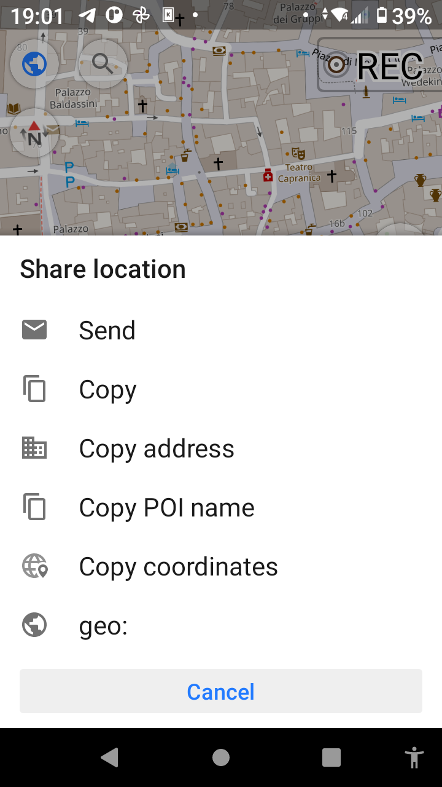
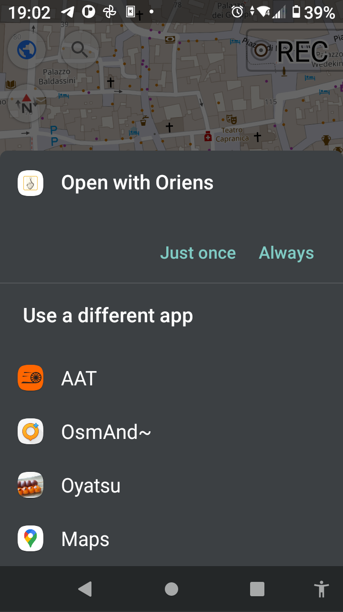

# Oriens

A widget to divine the sacred hour of mid-day repose.

For those who cannot carry a **sundial** or the legendary **Prosciutto Timepiece** of Ancient Rome, fear not! Oriens ensures your *hora sexta* (the sixth hour) is never lost to time.  

**siesta** : *Siesta* (from Spanish) refers to the midday break, typically between 13:00 - 16:00. The term traces back to Latin *hora sexta* – the sixth hour after sunrise, roughly around noon. In Portuguese, the same root gives *sesta*.  
A siesta need not include sleep — even wakefulness is sanctioned in this sacred interval of rest.  

**Prosciutto Timepiece** :  
   

## Features

- Roman Timekeeping (Unequal Hours)
- Roman Night Watches
- Gregorian Calendar
- Sunrise and Sunset

Roman hours are calculated based on your geographical coordinates (latitude and longitude).  
If no location is set (i.e., freshly installed), we default to the glorious Pantheon: (41.89862723117168, 12.476861603108699).  

## How to Use

An Android widget application. Free. No tributes (ads).

- Download via F-Droid: [F-Droid](https://f-droid.org/packages/lab.rredd.oriens/)

- Or procure the latest artifact from the [release page](https://github.com/tknv/oriens/releases) on GitHub.

**If time feels unaligned with the heavens, tap the widget to recalibrate.**

### Screenshot

- Display in the launcher  
    

- Widget appearance  
    

- App interface  
    

### Setup Flow

- Install
- Bestow coordinates upon the app
- Place the widget upon the Home screen 

### Configuration

### Input Coordinates

#### Copy and paste values from Google Maps or similar sources.

#### Use OsmAnd (a map scroll of OpenStreet cartography)

OsmAnd is “**an offline and online global mobile map & navigation scroll**” for all your quests — hiking, sailing, skiing.  

Available from [OsmAnd - Google Play Store](https://play.google.com/store/apps/details?id=net.osmand&pcampaignid=web_share) or [OsmAnd - F-Droid](https://f-droid.org/ja/packages/net.osmand.plus/). Share your chosen geo:latitude,longitude with Oriens.

#### Employ AAT (a chariot-tracking app)

AAT: “A GPS scroll for tracking athletic journeys, favored by cyclists, runners, and other Roman athletes.”  

Download from [AAT - F-Droid](https://f-droid.org/packages/ch.bailu.aat/) or read more [AAT - GitHub](https://github.com/bailuk/AAT/tree/master).

Enter the MAP, center your desired location, and tap the left-side menu. Tap the marker to view and share geo coordinates with Oriens.

### Placing the Widget Upon Your Domus

Long-press the Home screen, invoke the widget menu, and drag the sacred Oriens to a place of honor.  

## License

[GNU GPLv3 or later](http://www.gnu.org/licenses/gpl.html)

## Sources

### Siesta

[Siesta – Wikipedia](https://en.wikipedia.org/wiki/Siesta)

### Sundial

[sundial - Wikipedia](https://en.wikipedia.org/wiki/Sundial)

### Prosciutto Timepiece

[Cadran antique - Wikipedia (Fr)](https://fr.wikipedia.org/wiki/Cadran_antique) – See “Jambon de Portici” type sundials

---

Copyright (C) [2025]  
This work incorporates AI-assisted elements.  
This software is free as in liberty and bread. You may redistribute or modify it under the terms of the GNU General Public License as published by the Free Software Foundation, version 3 or (at your discretion) any later version.  

This program is shared in the hope it will be useful, but without warranty; without even the implied warranty of merchantability or fitness for a particular purpose. See the GNU General Public License for more details.  
If you have not received a copy, visit https://www.gnu.org/licenses/
