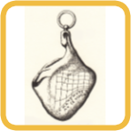

# オリエンス  

お昼寝の時間を把握する為のウィジット。

お昼寝の時間であるラテン語の hora sexta（第六時）**シエスタ** を確実にする為に **日時計** や古代ローマからの **プロシュートの携帯時計** を持ち歩けない人に。

**シエスタ** : シエスタ（西: siesta）は、昼休憩（13:00 - 16:00が目安）を指す言葉であり、昼寝をしなくてもシエスタと呼ぶ。本来、siesta の言葉言葉は、ラテン語の hora sexta（第六時）における sexta を由来とする。すなわち日の出を基準として「第6時」（日の出から6時間後）、つまり、おおよそ正午辺りの時間帯の意味である。ポルトガル語では、同語源の語で sesta（セスタ）と呼ばれる。  

siesta は単なる昼寝を意味するものではなく、長い昼休みに何をしてもよいということである。つまり、起きていてもsiesta である。  

 **プロシュートの携帯時計** :  
   

## 機能  

- 古代ローマ時刻(不定時法)
- 夜警時
- グレゴリオ暦
- 日の出、日の入り

古代ローマ時刻は位置情報:経度緯度から計算して表示します.  
位置情報を設定しない場合(インストールしたまま)はパンテオン(41.89862723117168, 12.476861603108699)を使います.  

## 使い方 

アンドロイドのウィジェット アプリです。 無料、広告なし。

- F-Droidからダウンロード [F-Droid](https://f-droid.org/packages/lab.rredd.oriens/).  

  
      
- ここサイトの [release page](https://github.com/tknv/oriens/releases) から最新版をダウンロードしてインストール  

**時間が合ってないなと思ったらウィジットをタップしてみてください。**    

### スクリーンショット  

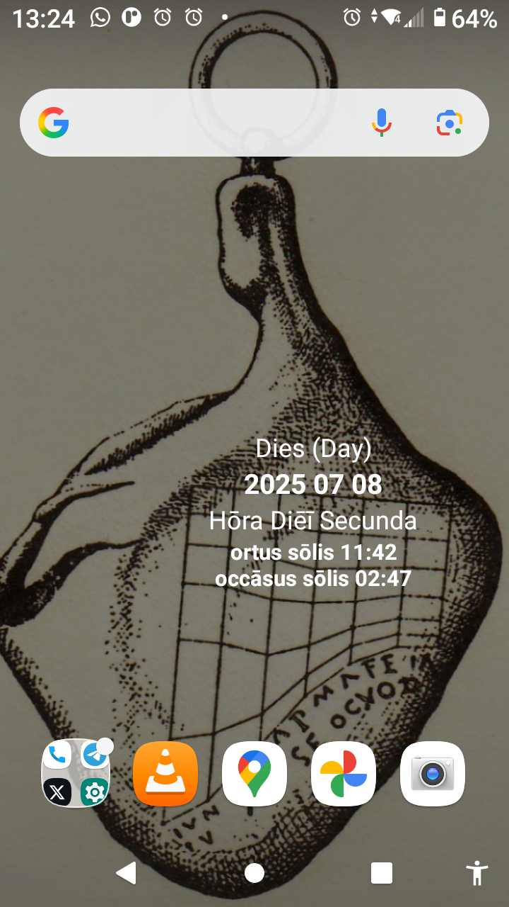  

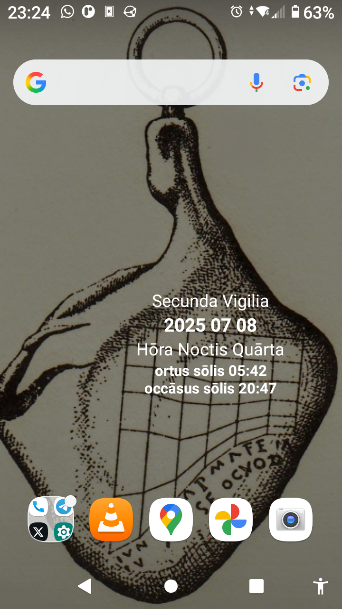 

- ランチャーでの表示  
 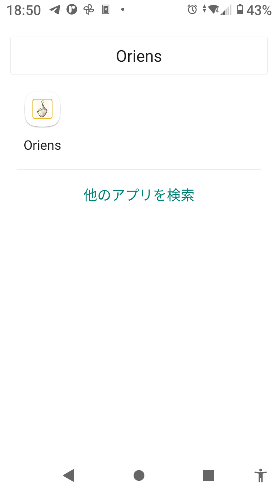  

 - ウィジェットでの表示  
 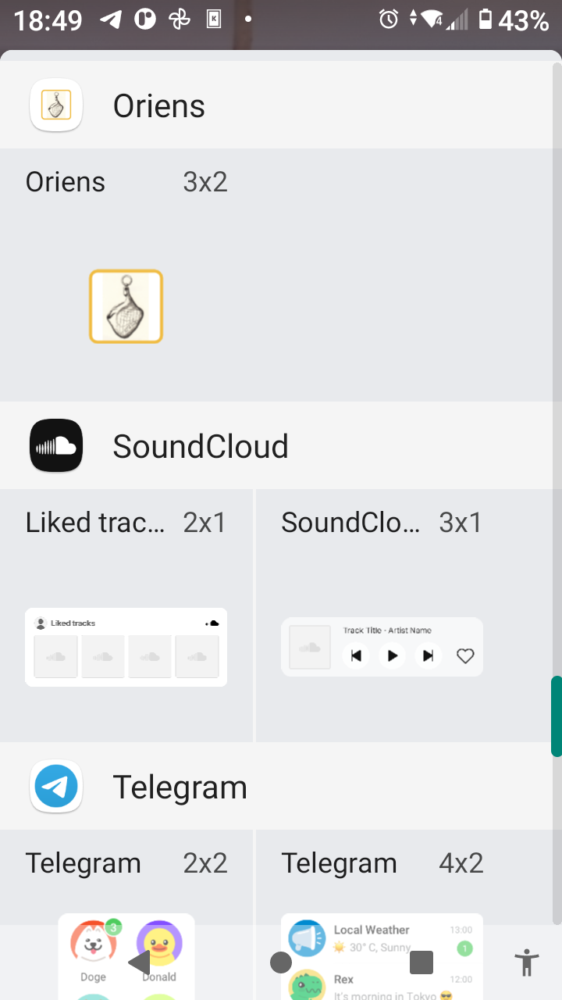  

  - アプリケーションでの表示  
 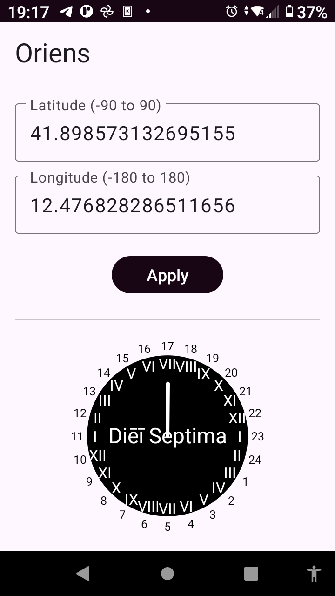  

### 流れ  

- インストール
- 位置情報を入れて適用
- ウィジットをホームに配置

### 設定 

### 位置情報を入れる

#### グーグルマップなどから緯度経度の数値をコピペする  

#### OsmAnd(オープンストリートマップアプリケーションを使う  

OsmAndとは、" **オフラインとオンラインのOSMマップのグローバルモバイルマップ表示とナビゲーション** " インターネットのないところでも使えます。様々な目的にあった地図が選べます、ハイキング用、スキー用、航海用など。

[OsmAnd - Google Play Store](https://play.google.com/store/apps/details?id=net.osmand&pcampaignid=web_share) もしくは [OsmAnd - F-droid](https://f-droid.org/ja/packages/net.osmand.plus/) からダウンロードしてインストールした後に共有からgeo:緯度、経度をオリエンスに設定する。  

地図で時刻をしりたい場所を選択する。古代ローマ時計の時刻はその場所の日出、日入から計算されます。
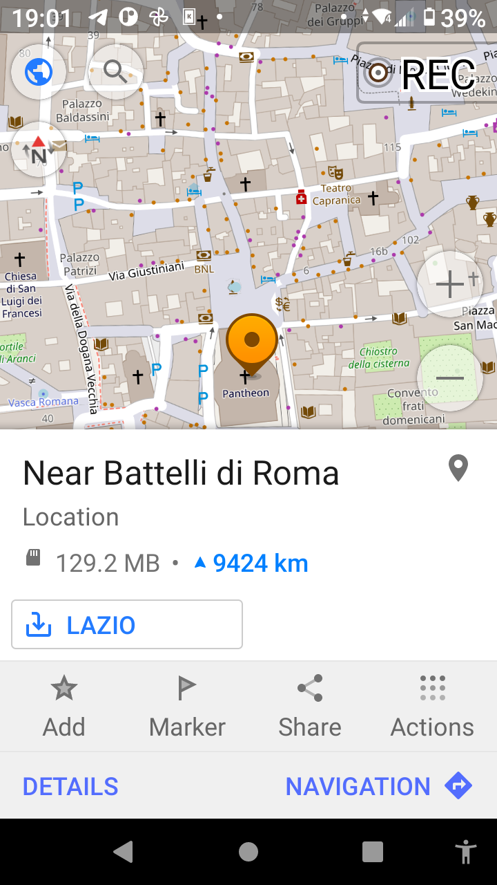  
共有をお押すとどの方法で共有するかの項目が表示されます。  
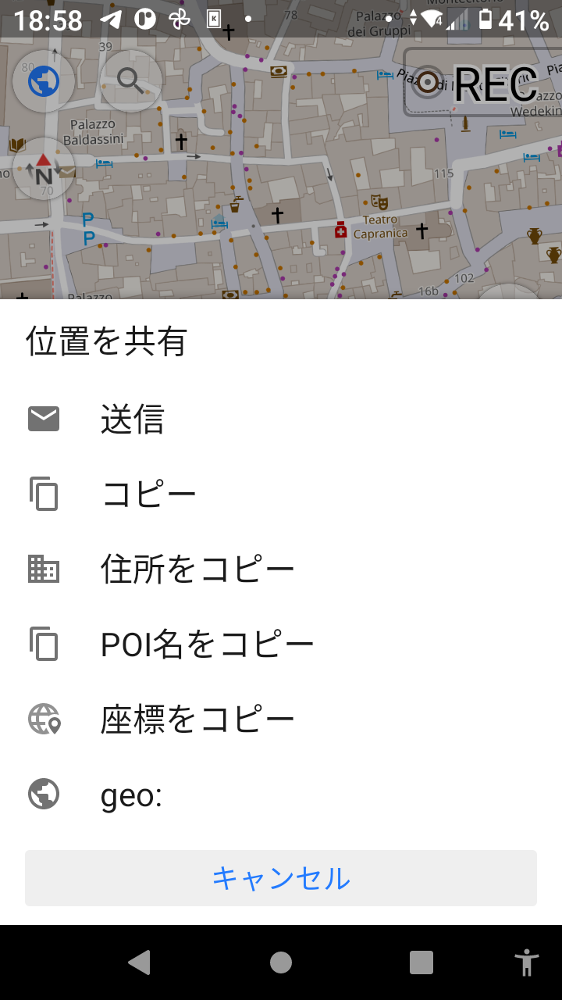  
geo: を選択するとどのアプリに共有するか表示されます。  
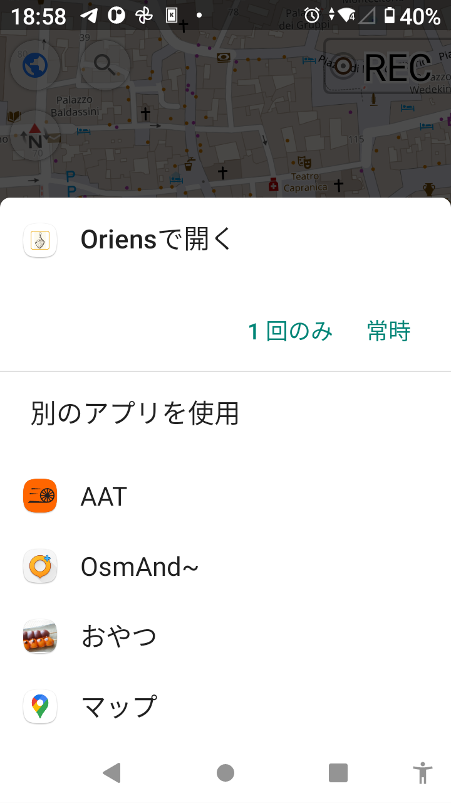  
"１回のみ" を選択するとオリエンスの位置情報入力画面に選択した地点の緯度経度が入力されています。  
  
適用を押します。  

#### AATを使う  

AATとは、"GPS-tracking application for sportive activities, with emphasis on cycling."、自転車、ハイキング、マラソンなど、スポーツで場所と速度、高低差などの情報もとれます。マップも様々なものから選択可能。 

[AAT - F-droid](https://f-droid.org/packages/ch.bailu.aat/) からダウンロードしてインストールした後に共有からgeo:緯度、経度をオリエンスに設定する。  
[AAT - Github](https://github.com/bailuk/AAT/tree/master) ここに情報があります。  

起動して、MAPに行き、地図で時刻を知りたい場所を画面中央にする(画面の下部をタップし、四角の1を押すと現在の場所になります)、そして **画面左側をタップする** とかメニューが出ます、マーカーアイコンを押す。  
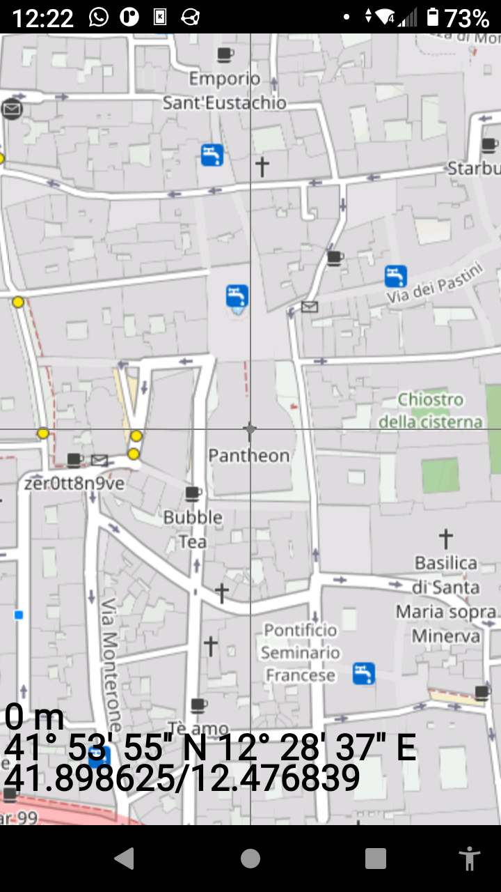  
このマーカー項目にある View location... を選びます。  
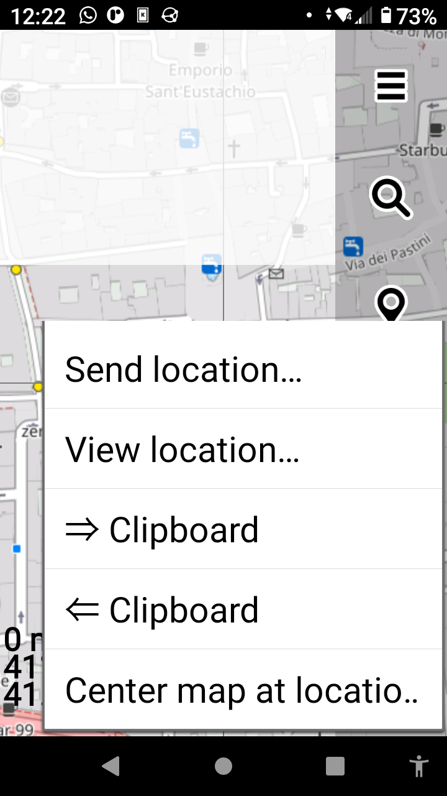   
選択した地点の緯度経度がgeo:緯度 経度で表示され、オリエンスがあるので選択します。  
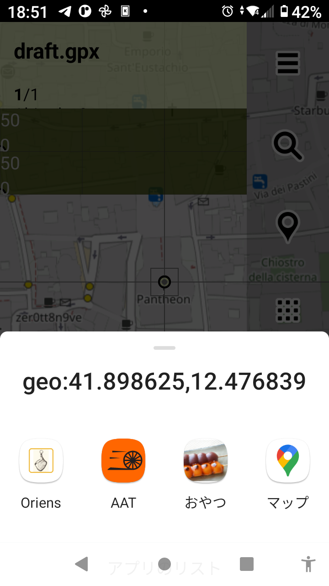  
ここで適用するとその地点での古代ローマ時刻を表示します。   
    

### ウィジットをホーム画面に置く  

ホーム画面を長押しするとポップアップがでます。そこでウィジットを押すとウィジット選択画面がでるのでオリエンスをドラッグ アンド ドロップでホーム画面に配置してください。  
   

## ライセンス 

[GNU GPLv3 or later](http://www.gnu.org/licenses/gpl.html)  

## 出典 

### シエスタ 

[シエスタ](https://ja.wikipedia.org/wiki/%E3%82%B7%E3%82%A8%E3%82%B9%E3%82%BF)

### 日時計 

[^日時計](https://ja.wikipedia.org/wiki/%E6%97%A5%E6%99%82%E8%A8%88)

### プロシュートの携帯時計  

[プロシュートの携帯時計]: [Cadran antique](https://fr.wikipedia.org/wiki/Cadran_antique)  
このリンク内の "Le cadran type « Jambon de Portici »"

Copyright (C) [2025]  
This work incorporates AI-assisted.  
本作品はAI支援を含みます。  

このプログラムはフリーソフトウェアです。あなたはこれを、フリーソフトウェア財団によって発行されたGNU一般公衆利用許諾書（バージョン3か、それ以降のバージョンのうちどれか）が定める条件の下で再頒布または改変することができます。
このプログラムは有用であることを願って頒布されますが、全くの無保証です。商業可能性の保証や特定目的への適合性は、言外に示されたものも含め、全く存在しません。詳しくはGNU一般公衆利用許諾書をご覧ください。
あなたはこのプログラムと共に、GNU一般公衆利用許諾書のコピーを一部受け取っているはずです。もし受け取っていなければ、https://www.gnu.org/licenses/ をご覧ください。